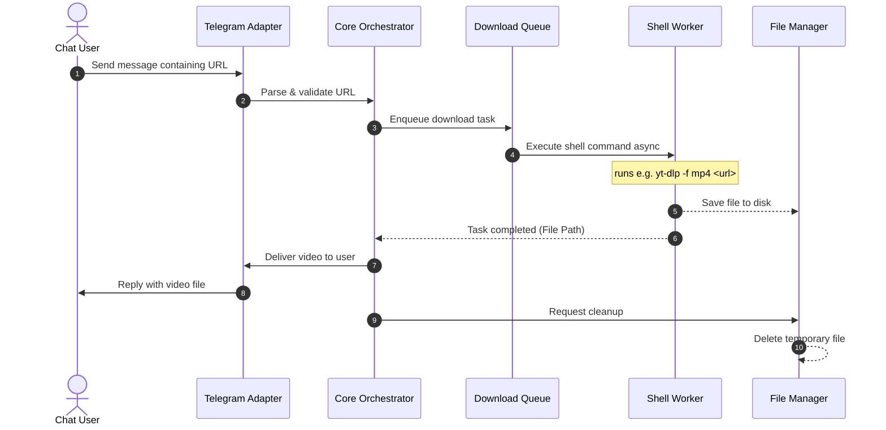

# VideoLib — Telegram Video Downloader Bot

[](https://www.python.org/)
[](https://core.telegram.org/bots)
[](https://github.com/yt-dlp/yt-dlp)
[](https://opensource.org/licenses/MIT)

**VideoLib** is a modular Telegram bot designed to receive URLs from users, download videos using a configurable shell command (such as `yt-dlp`), and reply directly with the downloaded media. Built for high extensibility, it orchestrates downloads and media processing specifically for Telegram.

---

## 🌟 Key Features

* **Telegram Integration**: Tailored specifically for the Telegram Bot API.
* **Non-Blocking Execution**: Asynchronous task runner ensuring bot responsiveness during long download tasks.
* **Custom Command Wrapper**: Run any shell command (e.g., `yt-dlp`, `ffmpeg`, custom scripts) to fetch and process media.
* **Automatic File Cleanup**: Instantly cleans up temporary files post-delivery or on download failure to preserve disk space.
* **Task Queues**: Rate-limiting and download queues to prevent server overload.

---

## 📐 System Architecture

VideoLib is designed with a decoupled architecture. Below is the system flow for a typical request:



### Component Breakdown

1. **Telegram Adapter** (`src/platforms/`): Listens to Telegram events, normalizes messages into internal events, and handles file uploads.
2. **Core Orchestrator** (`src/core/`): Manages the state machine of the request, routing messages between the adapter, queues, and command runners.
3. **Download Queue** (`src/queue/`): Controls concurrency, retries, and rate limits.
4. **Shell Execution Worker** (`src/downloader/`): Runs subprocesses asynchronously using Python's `asyncio.subprocess` to prevent blocking the event loop.
5. **Storage Manager** (`src/storage/`): Handles temporary directories, naming collisions, and guaranteed deletion hooks.

---

## 📂 Project Structure

```text
videolib/
├── .env.example             # Configuration template
├── README.md                # System documentation
├── AGENTS.md                # AI agent instructions
├── requirements.txt         # Dependencies
├── run.py                   # Entry point
└── src/
    ├── __init__.py
    ├── config.py            # Settings and env loading
    ├── core/                # Core orchestrator and task runners
    │   ├── __init__.py
    │   └── orchestrator.py
    ├── downloader/          # Subprocess wrappers for shell commands
    │   ├── __init__.py
    │   └── shell_runner.py
    ├── platforms/           # Platform abstraction and implementations
    │   ├── __init__.py
    │   ├── base.py          # Platform interface
    │   └── telegram.py      # Telegram implementation
    ├── storage/             # File storage & cleanup utility
    │   ├── __init__.py
    │   └── manager.py
    └── utils/               # Shared helpers (logger, parsing)
        ├── __init__.py
        └── logger.py
```

---

## 🚀 Getting Started

### Prerequisites

* **Python 3.10+**
* **FFmpeg**: Required by many downloader packages (like `yt-dlp`) for merging/transcoding video.
  * *macOS*: `brew install ffmpeg`
  * *Linux (Ubuntu)*: `sudo apt install ffmpeg`


### Installation

1. Clone the repository:
   ```bash
   git clone https://github.com/username/videolib.git
   cd videolib
   ```

2. Create a virtual environment and activate it:
   ```bash
   python3 -m venv .venv
   source .venv/bin/activate
   ```

3. Install requirements:
   ```bash
   pip install -r requirements.txt
   ```

### Configuration

Copy `.env.example` to `.env` and fill in the required tokens and command structures:
```bash
cp .env.example .env
```

#### Environment Variables

| Variable | Description | Default |
| :--- | :--- | :--- |
| `TELEGRAM_BOT_TOKEN` | Bot token from [@BotFather](https://t.me/BotFather) | (Required) |
| `TELEGRAM_API_URL` | Optional custom Local Bot API server URL | `https://api.telegram.org` |
| `DOWNLOAD_DIR` | Relative path where temporary files are stored | `./tmp` |
| `DOWNLOAD_COMMAND` | Shell command template. Use `{url}` and `{output_path}` as placeholders. | `yt-dlp -f "bestvideo[ext=mp4]+bestaudio[ext=m4a]/best[ext=mp4]/best" --merge-output-format mp4 -o "{output_path}" "{url}"` |
| `MAX_CONCURRENT_DOWNLOADS` | Max number of videos downloading at the same time | `3` |
| `MAX_FILE_SIZE_MB` | Maximum size in MB to download and send | `50` |

### Running the Local Telegram Bot API (Optional)

For handling large files (up to 2GB via Telegram Bot API) or reducing network overhead, you can run a local Telegram Bot API server using Docker. 

Run the generic container with Docker:

```bash
docker run -d -p 8081:8081 \
  --name=telegram-bot-api \
  --restart=always \
  -v telegram-bot-api-data:/var/lib/telegram-bot-api \
  -e TELEGRAM_API_ID="<YOUR_API_ID>" \
  -e TELEGRAM_API_HASH="<YOUR_API_HASH>" \
  aiogram/telegram-bot-api:latest
```
*(Make sure to replace `<YOUR_API_ID>` and `<YOUR_API_HASH>` with your credentials from my.telegram.org.)*

After starting the container, update your `.env` file to point to the local instance (for example, `TELEGRAM_API_URL=http://localhost:8081`).

### Running the Bot

Run the entrypoint to start the bot:
```bash
python run.py
```

---

## 📄 License

This project is licensed under the MIT License - see the LICENSE file for details.
