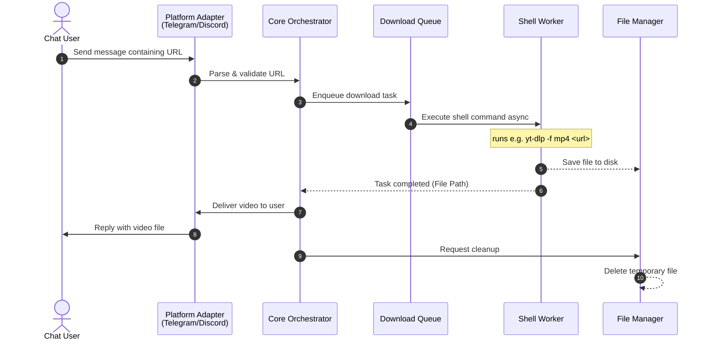

# VidoLib — Telegram Video Downloader Bot

[](https://www.python.org/)
[](https://core.telegram.org/bots)
[](https://discord.com/developers/docs/intro)
[](https://github.com/yt-dlp/yt-dlp)
[](https://opensource.org/licenses/MIT)

**CornBot** is a modular, multi-platform chat bot designed to receive URLs from users, download videos using a configurable shell command (such as `yt-dlp`), and reply directly with the downloaded media. Built for high extensibility, it isolates platform-specific logic from the download orchestrator, making it easy to support Telegram, Discord, and other messaging networks.

---

## 🌟 Key Features

* **Multi-Platform Support**: Built-in architecture for Telegram and Discord adapters.
* **Non-Blocking Execution**: Asynchronous task runner ensuring bot responsiveness during long download tasks.
* **Custom Command Wrapper**: Run any shell command (e.g., `yt-dlp`, `ffmpeg`, custom scripts) to fetch and process media.
* **Automatic File Cleanup**: Instantly cleans up temporary files post-delivery or on download failure to preserve disk space.
* **Task Queues**: Rate-limiting and download queues to prevent server overload.

---

## 📐 System Architecture

CornBot is designed with a decoupled architecture. Below is the system flow for a typical request:



### Component Breakdown

1. **Platform Adapters** (`src/platforms/`): Listens to platform-specific events, normalizes messages into internal events, and handles file uploads.
2. **Core Orchestrator** (`src/core/`): Manages the state machine of the request, routing messages between adapters, queues, and command runners.
3. **Download Queue** (`src/queue/`): Controls concurrency, retries, and rate limits.
4. **Shell Execution Worker** (`src/downloader/`): Runs subprocesses asynchronously using Python's `asyncio.subprocess` to prevent blocking the event loop.
5. **Storage Manager** (`src/storage/`): Handles temporary directories, naming collisions, and guaranteed deletion hooks.

---

## 📂 Project Structure

```text
cornbot/
├── .env.example             # Configuration template
├── README.md                # System documentation
├── AGENTS.md                # AI agent instructions
├── requirements.txt         # Dependencies
├── run.py                   # Entry point
└── src/
    ├── __init__.py
    ├── config.py            # Settings and env loading
    ├── core/                # Core orchestrator and task runners
    │   ├── __init__.py
    │   └── orchestrator.py
    ├── downloader/          # Subprocess wrappers for shell commands
    │   ├── __init__.py
    │   └── shell_runner.py
    ├── platforms/           # Platform abstraction and implementations
    │   ├── __init__.py
    │   ├── base.py          # Platform interface
    │   ├── telegram.py      # Telegram implementation
    │   └── discord.py       # Discord implementation
    ├── storage/             # File storage & cleanup utility
    │   ├── __init__.py
    │   └── manager.py
    └── utils/               # Shared helpers (logger, parsing)
        ├── __init__.py
        └── logger.py
```

---

## 🚀 Getting Started

### Prerequisites

* **Python 3.10+**
* **FFmpeg**: Required by many downloader packages (like `yt-dlp`) for merging/transcoding video.
  * *macOS*: `brew install ffmpeg`
  * *Linux (Ubuntu)*: `sudo apt install ffmpeg`
* **yt-dlp** (or your downloader of choice):
  * *macOS*: `brew install yt-dlp`
  * *Linux (Ubuntu)*: `sudo apt install yt-dlp` or install via pip.

### Installation

1. Clone the repository:
   ```bash
   git clone https://github.com/username/cornbot.git
   cd cornbot
   ```

2. Create a virtual environment and activate it:
   ```bash
   python3 -m venv .venv
   source .venv/bin/activate
   ```

3. Install requirements:
   ```bash
   pip install -r requirements.txt
   ```

### Configuration

Copy `.env.example` to `.env` and fill in the required tokens and command structures:
```bash
cp .env.example .env
```

#### Environment Variables

| Variable | Description | Default |
| :--- | :--- | :--- |
| `TELEGRAM_BOT_TOKEN` | Bot token from [@BotFather](https://t.me/BotFather) | (Required for Telegram) |
| `DISCORD_BOT_TOKEN` | Bot token from Discord Developer Portal | (Required for Discord) |
| `DOWNLOAD_DIR` | Relative path where temporary files are stored | `./tmp` |
| `DOWNLOAD_COMMAND` | Shell command template. Use `{url}` and `{output_path}` as placeholders. | `yt-dlp -f "bestvideo[ext=mp4]+bestaudio[ext=m4a]/best[ext=mp4]/best" --merge-output-format mp4 -o "{output_path}" "{url}"` |
| `MAX_CONCURRENT_DOWNLOADS` | Max number of videos downloading at the same time | `3` |
| `MAX_FILE_SIZE_MB` | Maximum size in MB to download and send | `50` |

### Running the Bot

Run the unified entrypoint to spin up configured platform adapters:
```bash
python run.py
```

---

## 🛠️ Extensibility: Adding a Platform

All platforms inherit from `BasePlatform` in [src/platforms/base.py](file:///Users/k/cornbot/src/platforms/base.py). To add a new platform:

1. Create a file under `src/platforms/` (e.g. `slack.py`).
2. Inherit from `BasePlatform` and implement:
   * `async def start(self) -> None`: Initialize connection and start listening.
   * `async def stop(self) -> None`: Cleanly shut down connections.
   * `async def send_video(self, chat_id: str, file_path: str, caption: str) -> None`: Deliver file.
   * `async def send_message(self, chat_id: str, text: str) -> None`: Send status/error messages.
3. Import and initialize it in `run.py`.

---

## 📄 License

This project is licensed under the MIT License - see the LICENSE file for details.
>>>>>>> 3f45bb6 (init)
